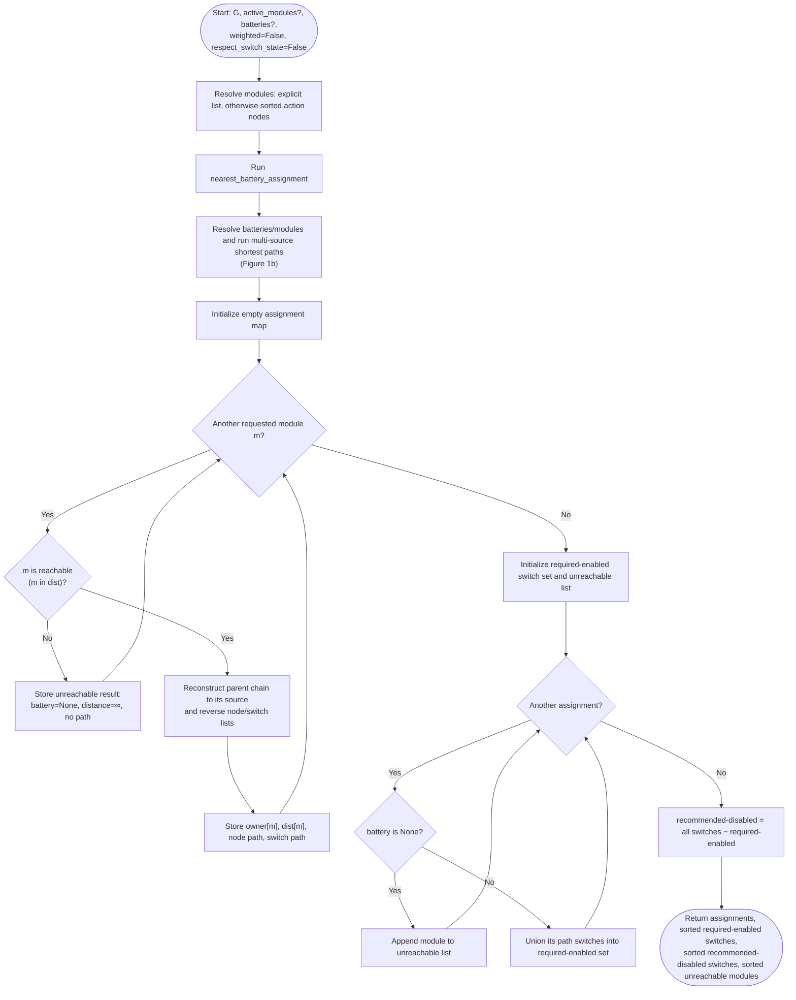
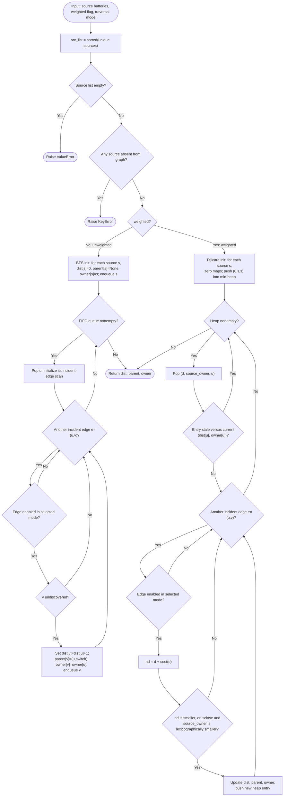
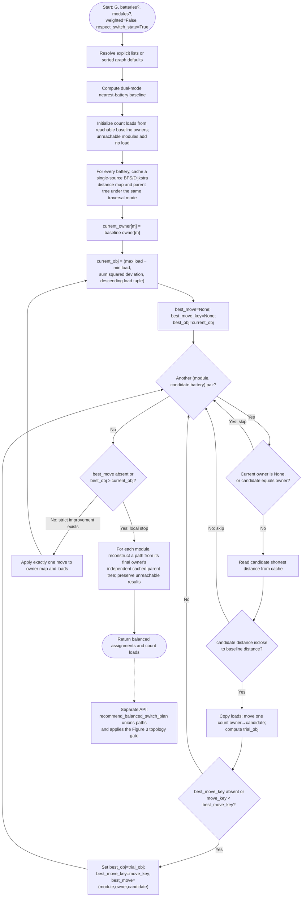
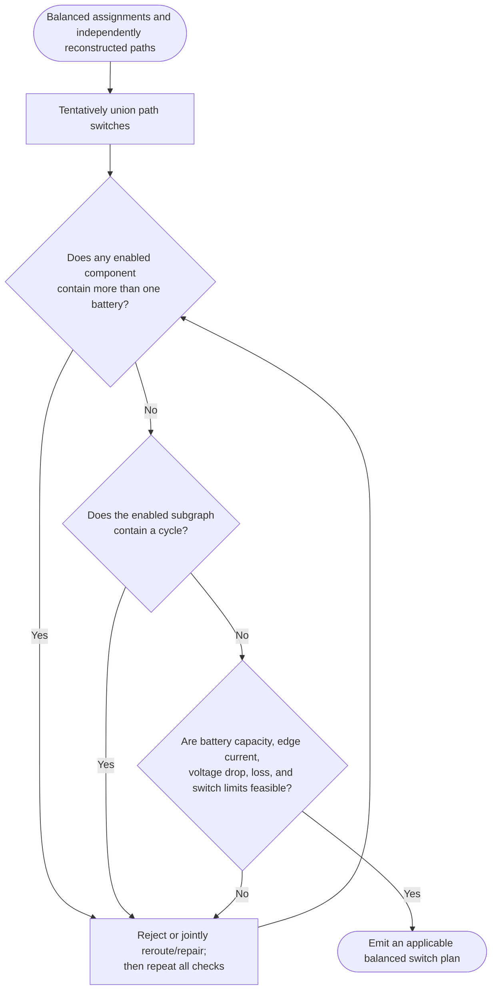

# Power-Routing Algorithms for Reconfigurable Modular Robots

**Code-faithful flowcharts, theoretical comparison, literature survey, and reproducible simulation study**  
**Review date:** 20 July 2026

> **Implementation update (28 August 2026):** balanced mode now accepts the
> role-aware rotated `layout` JSON and provides
> `recommend_balanced_switch_plan()`. The method still reconstructs independent
> balanced paths, but their union is now checked before output: a multi-battery
> connected component causes the plan to fail closed. The raw-path safety
> counterexamples and benchmark results below remain relevant; they explain why
> this new gate is necessary. Electrical current, voltage, loss, and hardware
> interlocks are still outside the model.

> **Demand-aware extension:** roles 2–16 are now powered loads with default
> weights motor=5, navigation=4, CPU=3, buffer1–11=2, and empty=1.
> `recommend_demand_aware_switch_plan()` combines per-battery BFS routes
> with a bounded exact, battery-isolated global assignment. With unknown switch
> loss, its default lexicographic objective minimizes peak module demand,
> demand spread, variance, and only then total demand-weighted route cost; an
> optional `route_loss_factor` supports later sensitivity studies.

## Executive summary

1. The repository's **dual-mode** method is a centralized multi-source shortest-path algorithm. Planning mode searches the complete physical graph; runtime mode searches only currently enabled links. In unweighted mode, and in weighted mode with strictly positive traversed costs, its selected parent edges form a battery-rooted forest. The current weighted code also accepts zero-cost edges; in that edge case, one battery can be reparented through another domain and the switch union can join sources.
2. The showcased **balanced** method is a post-processor over the nearest-battery result. It changes an action module's owner only when another battery has the same shortest distance and a single reassignment strictly improves the lexicographic count-load objective. It preserves route distance, but it is a local heuristic rather than a global optimizer.
3. The low-level balanced assignment method returns independently reconstructed per-battery paths whose direct union can join battery domains. The newer `recommend_balanced_switch_plan()` API now detects that condition and fails closed instead of emitting the unsafe switch set. It remains a graph-topology gate, not a complete electrical-feasibility stage.
4. The closest prior work separates into three families: distributed rail routing (Campbell et al.), state-of-charge/lifetime sharing (Raja and Scholz; Chen et al.; 3PAC; Mori3; power packets), and safe sharing-topology construction (FreeBOT). The closest transferable formal optimizer is graph-based energy routing in an energy local-area network. None is an exact drop-in baseline for this repository's graph and switch semantics.
5. Repository demos and a seeded Monte Carlo study confirm that balancing improves the abstract load-count objective without increasing per-module shortest distance. They also expose the topology-safety gap. The recommended next method is a safety-constrained, lexicographic min-cost flow or mixed-integer model that co-optimizes service, battery utilization, losses, and switch changes.

## 1. Scope and exact model

Let the modular robot be an undirected graph \(G=(V,E)\), with selected batteries \(B\subset V\), requested action modules \(A\subset V\), switch identifier \(s_e\), and nonnegative stored edge cost \(c_e\). The effective route weight is 1 in unweighted mode and \(c_e\) in weighted mode.

The traversal predicate implemented in both files is

\[
T(e)=\neg\texttt{respect\_switch\_state}\;\lor\;\texttt{switch\_open}[s_e].
\]

Consequently:

- **Planning mode:** `respect_switch_state=False`; every physical edge is eligible.
- **Runtime mode:** `respect_switch_state=True`; only a switch whose stored value is `True` is eligible.

The code uses “open” to mean **enabled/conducting**, which is opposite to conventional circuit-breaker language. The flowcharts use “enabled” to avoid that ambiguity. See [`_edge_traversable`](power_routing_duo_mode.py#L82-L89).

The figures below describe the code that is actually demonstrated:

- dual-mode: [`recommend_switch_plan`](power_routing_duo_mode.py#L459-L515), using [`nearest_battery_assignment`](power_routing_duo_mode.py#L406-L453);
- balanced: [`rebalanced_nearest_battery_assignment`](power_routing_balanced.py#L457-L560).

`dynamic_load_balanced_assignment` is a separate, online and order-dependent variant; it is summarized later but is not mislabeled as the main balanced algorithm.

## 2. Complete dual-mode flowchart

### Figure 1a — End-to-end assignment and switch recommendation



This routine only recommends states; it does not actuate switches.

### Figure 1b — Shared multi-source shortest-path engine



### When the dual-mode switch union is structurally safe

All batteries enter the search as roots with no parent. In unweighted BFS, a discovered node is never updated. In weighted Dijkstra with **strictly positive** costs, no route back to a zero-distance source can tie its zero label. Under either condition, every non-source reached node receives exactly one parent and one owner, while sources remain roots. The complete parent relation is then a multi-root forest; selecting a subset of its root-to-action paths remains a forest. At the graph abstraction level, it has:

- no cycles;
- at most one selected battery per connected component;
- one deterministic battery domain per reached node.

The older dual-mode graph constructor permits `cost=0`. In weighted mode, its tie rule can then replace a source's owner and parent. A deterministic counterexample is `B1 —0— X —0— B2 —1— M`: `B2` becomes owned by `B1`, and the recommended path to `M` is `B1 → X → B2 → M`, joining both batteries. Balanced mode now makes selected source labels immutable and blocks routes through other known batteries; the standalone dual-mode file still needs the equivalent guard.

Even under the forest condition, this is not a proof of electrical feasibility: the model still omits current, voltage drop, conversion efficiency, state of charge, transient behavior, and switch ratings.

## 3. Complete balanced flowchart

### Figure 2 — Showcased equal-distance rebalancing algorithm



The move comparison retains the full best key, so equal-objective moves resolve deterministically by `(module, owner, candidate)` rather than allowing the last scanned move to win. This fixes the earlier input-order-sensitive tie behavior; it does not make the greedy local search globally optimal.

### Figure 3 — Implemented topology gate and remaining deployment checks



`recommend_switch_plan()` intentionally remains the original nearest-only API. The newer `recommend_balanced_switch_plan()` follows the balanced assignments, rejects a union that contains a multi-battery component, and emits no required-closed set in that case. Figure 3's current/voltage/loss checks and hardware interlocks remain production extensions.

## 4. Formal properties and theoretical comparison of the repository algorithms

For each action \(a\), let \(d_b(a)\) be its shortest-path distance from battery \(b\) in the selected planning/runtime graph.

The intended dual-mode assignment is

\[
b_0(a)\in\arg\min_{b\in B}(d_b(a),\;\text{battery ID}),
\]

with first-discovery behavior for unweighted path ties. In weighted code, `math.isclose` makes this an approximate rather than exact numeric lexicographic rule. The balanced candidate set is

\[
C_a=\{b\in B:\operatorname{isclose}(d_b(a),d_{b_0(a)}(a))\}.
\]

For count load \(L_b=|\{a:b(a)=b\}|\), balanced mode uses the following lexicographic objective for strict single-move improvements:

\[
F(L)=\left(\max_bL_b-\min_bL_b,\;\sum_b(L_b-\bar L)^2,\;\operatorname{sort}_{\downarrow}(L)\right).
\]

| Property | Dual-mode | Balanced post-processor |
|---|---|---|
| Primary objective | Minimum additive route cost for each action | Improve count-load fairness while retaining a baseline-shortest distance |
| Search | One multi-source BFS or Dijkstra | Baseline search + one single-source search per battery + repeated one-module move scan |
| Exactness | Unweighted paths are exact; weighted ownership is exact only up to the implementation's `math.isclose` tolerance for finite nonnegative costs | Terminates at a strict single-move local optimum; not globally optimal in general |
| Planning/runtime distinction | Yes, through one traversal predicate | Yes, inherited by every baseline/cache search |
| Unreachable actions | Explicit `battery=None`, `distance=∞` | Preserved from baseline |
| Tie behavior | Sorted source IDs; exact path can depend on adjacency insertion order | Equal-distance moves only; equal-objective moves now use a persistent deterministic key |
| Per-action route cost after balancing | Not applicable | Equal in unweighted mode; only `math.isclose` in weighted mode |
| Switch result | Complete recommendation; battery-isolated forest for unweighted or strictly-positive weighted costs, but not for accepted zero-cost weighted edges in the older dual-mode file | `recommend_balanced_switch_plan()` fails closed on a multi-battery union; raw assignment-path union remains unsafe |
| Battery/edge capacity, SoC, demand | Not modeled | Not modeled; “load” is module count only |
| Electrical laws and loss | Edge cost is only an abstract additive weight | Same limitation |
| Unweighted complexity | \(O(V+E)\), plus reconstructed path lengths | Initialization \(O(B(V+E))\); each iteration scans up to \(A(B-1)\) moves and copies \(B\) loads, i.e. \(O(AB^2)\) per iteration |
| Weighted complexity | \(O((V+E)\log V)\), plus reconstruction | Initialization \(O(B(V+E)\log V)\), plus the same rebalance scans |

Strict decrease of \(F\) over a finite assignment space proves termination. It does not prove a polynomial iteration bound or global optimality.

A three-action eligibility counterexample proves the local/global gap. Let `m1→{B0}`, `m2→{B0,B1}`, and `m3→{B1,B2}`, where every listed battery is at the same shortest distance for that action. The baseline loads are `(2,1,0)`. Either available single move only permutes `(2,1,0)`, so the strict-improvement loop stops. Applying both moves yields the globally balanced `(1,1,1)`. A bipartite b-matching, convex-cost flow, or the benchmark's load-vector dynamic program solves this equal-distance subproblem globally.

### Correctness and robustness issues found during review

1. **Balanced topology safety:** independent single-source trees can cross battery domains, join batteries, or form cycles.
2. **Balanced switch API mismatch:** the file's switch recommender is still the nearest-only method.
3. **Equal-objective tie handling:** the earlier last-scanned/input-order bug was fixed with a persistent deterministic move key; path identity can still depend on adjacency insertion order when shortest paths tie.
4. **“Exact equality” is tolerance equality:** default `math.isclose` can accept a slightly longer weighted route.
5. **Weighted source isolation:** a zero-cost path can reparent a battery source under the Dijkstra tie rule and join selected batteries. Keep source labels immutable or require strictly positive route costs for the forest guarantee.
6. **Nonfinite edge costs:** graph validation rejects negative costs but accepts `NaN` and `∞`; production code should at least require `math.isfinite(cost) and cost >= 0`.
7. **Input typing and uniqueness:** explicit sources need not be typed as batteries; unknown requested modules become unreachable; duplicate module IDs can corrupt counts while collapsing dictionary output.
8. **Battery health:** runtime link filtering does not infer battery failure. Failed batteries must be removed from the explicit source list.
9. **Online secondary method:** `dynamic_load_balanced_assignment` greedily ranks `(distance, current count, battery ID)` in caller module order. It can double-count if a requested module is also present in `existing_assignments`.

## 5. Related power-routing and power-sharing methods

### Search scope

The search focused on combinations of *power routing*, *energy sharing*, *power management*, *self-reconfigurable modular robot*, *modular robot*, *energy routing graph*, *battery balancing*, and *power packet*. Primary papers, institutional publication records, and released datasets/code were preferred. The literature is sparse and uses different electrical abstractions, so “similar” is separated into routing, sharing/lifetime control, and topology/hardware methods.

### Evidence-backed comparison

| Method | Decision and objective | Control/information | Electrical or topology constraints | Validation | Relation to this repository |
|---|---|---|---|---|---|
| Campbell, Pillai & Goldstein, **The Robot is the Tether** (IROS 2005) | Assign unary contacts to virtual supply/ground rails using gradient, randomized, local negotiation, or pseudo-lattice rules | Distributed; local sensing/communication; no global topology required | Supply and ground require two edge-disjoint node-covering subgraphs; handles defects and limited storage in a resistor-network abstraction | SPICE-based simulation over several deployment conditions | Closest direct modular-robot **routing** work. More distributed/electrical; less globally cost-optimal than shortest paths. It exposes a two-rail constraint absent from this repository. [Paper](https://www.cs.cmu.edu/~claytronics/papers/campbell05.pdf) |
| Wang et al., **Power Management System for Heterogeneous Modules** (IROS 2011) | Select/share sources on a common power bus; protect modules | Local embedded hardware | Overcurrent and short-circuit protection; smooth source switching | Physical modules; reported hardware fault disconnection around 71 μs | Strong hardware safety reference, but not a route optimizer. [Institutional record and paper](https://www.dfki.de/web/forschung/projekte-publikationen/publikation/5524) |
| Raja & Scholz, **Dynamic Power Distribution and Energy Management** (2012) | Threshold policies share from higher-energy modules to depleted neighbors, with one- or two-hop state | Distributed neighborhood state | Hardware power-management layer and fault handling; no graph-wide route optimum | Real platform measurements plus simulation | A local SoC baseline for lifetime studies; unlike balanced mode, load is energy-aware. [Paper](https://arxiv.org/abs/1207.0350) |
| Chen et al., **Dynamic Power Sharing** (TAROS 2013) | Voltage-triggered help request, donor selection, and five hardware sharing modes | Distributed messages and local voltage | Offering, bypass, receiving, simultaneous charging/receiving, battery charging | SuperBot hardware; up to 30% longer operation in the reported imbalanced case | Provides executable sharing states and bypass semantics; route selection is heuristic rather than shortest-path optimization. [Paper record](https://robots.isi.edu/prl/b2hd-chen2013-Dynamic-Power-Sharing-for-Self-Reconfigurable-Modular-Robots.html) |
| Chen, Collins & Shen, **Near-Optimal Dynamic Power Sharing** (ICRA 2016) | Iterative local averaging estimates global remaining capacity and consumption; donor/receiver roles target maximum operation time | Distributed neighbor consensus and task negotiation | Includes approximate converter efficiency in evaluation, but the theoretical maximum is a lossless pooled-energy bound | Numerical and ReMod3D physics-based simulation | Best direct **lifetime objective** comparator; does not synthesize a minimum-loss, isolated switch forest. [Paper](https://robots.isi.edu/prl/chen2016-A-Near-Optimal-Dynamic-Power-Sharing-Scheme-for-Self-Reconfigurable-Modular-Robots.pdf) |
| Chen, Collins & Shen, **Maximal Operation Time with Output-Current Constraints** (ICCAR 2017) | Estimate maximum first-depletion time by transforming source budgets and output limits into a min-cost-flow-style allocation; centralized and neighborhood variants | Global priority-queue version or distributed local updates | Remaining capacity, consumption, per-module output-current limit; explicitly omits path loss and regulator efficiency | Random graphs up to 1,274 nodes and a 100-SuperBot ReBots simulation | Strong capacity-aware balancing baseline. The paper leaves actual minimum-cost path selection and path loss to future work, so it complements rather than replaces dual-mode. [Paper](https://robots.isi.edu/prl/chen2017-Maximal-Operation-Time-Estimation-for-Modular-and-Self-Reconfigurable-Robots-with-Output-Current-Constraints.pdf) |
| Wang et al., **Graph-Theory Energy Routing in e-LAN** (IEEE TII 2017) | Lowest-cost source/path selection; capacity screening and multi-source routing for heavy loads | Central/global link-state style information | Node conversion loss, link loss, and source/link capacity in an energy-router network | Case analyses and simulation | Closest transferable formal graph optimizer. It suggests adding capacity feasibility and physically meaningful loss weights to dual-mode. [Publication record](https://publications.aston.ac.uk/id/eprint/30978/) |
| Holdcroft et al., **3PAC** (IEEE/ASME T-Mech 2022) | Passive/local power sharing with communication through three contacts | Distributed and plug-and-play | Empirically modeled converter/contact circuit | Hardware; up to 62% runtime improvement in the reported simple system | A realistic hardware and loss-model substrate; it does not optimize graph routes. [EPFL record](https://graphsearch.epfl.ch/en/publication/b8527935-b041-488e-8fda-eac303202216) |
| Liang et al., **FreeBOT Energy Sharing Mechanism** (ICRA 2022) | Construct a sharing network with the maximum participating modules after deleting invalid components | Centralized topology processing in the presented system | Explicitly removes open/short/cyclic invalid components using an incidence-matrix procedure | FreeBOT prototype experiments | Closest topology-safety complement. Its cycle and invalid-component checks are exactly what a balanced switch plan presently lacks. [Paper](https://freeformrobotics.org/wp-content/uploads/2022/03/ICRA22_2123_FI.pdf) |
| Holdcroft et al., **Scalable Robot Collective Resilience** (Science Robotics 2026) | Local sharing of power, communication, and sensing redundancy | Distributed/local | Physical local sharing circuits and redundant resource paths | Mori3 hardware; a resource-deprived module is supported during locomotion | State-of-the-art resilience evidence; optimizes robustness by local redundancy rather than a centralized route cost. [PubMed](https://pubmed.ncbi.nlm.nih.gov/41671332/), [code/data](https://zenodo.org/records/18189133) |
| Sanada, Satoh & Arai, **Power Sharing Using Power Packet Technology** (2026) | Each cycle, longer predicted-active-time modules send tagged power packets to shorter-lived modules | Local estimates of remaining energy and consumption | Packetized transfer through prototype hardware | Simulation and a robot prototype | Promising lifetime-aware actuation mechanism; no repository-compatible path optimizer or public benchmark was found. [Bibliographic record and abstract](https://cir.nii.ac.jp/crid/1390307746609513984) |

### Theoretical synthesis

The methods solve related but nonidentical problems:

- **Dual-mode is strongest on route optimality and deterministic centralized planning**, but its “cost” is not yet an electrical loss model and it has no coupled capacity constraints.
- **Balanced is strongest only on count fairness under zero route-distance sacrifice.** Count fairness is not energy fairness when modules have different demands, path losses, or batteries have different state of charge/capacity.
- **Campbell provides a distributed routing alternative** when global topology is unavailable. Its local rules trade global optimality for scalability and autonomy.
- **Chen 2016 and the 2026 power-packet method optimize the correct temporal resource—remaining operating time.** They are better conceptual baselines for lifetime than equal module count.
- **FreeBOT and the 2011 PMS make electrical safety first-class.** This is the most urgent missing layer in the balanced method.
- **e-LAN energy routing supplies the closest mathematical extension:** screen infeasible sources/links, account for conversion/link losses, and permit capacity-constrained multi-source supply.

No retrieved primary paper exposes a drop-in implementation with the same graph, switch-state convention, path cost, and task set. A direct numerical reproduction would therefore compare incompatible models. The controlled repository-native experiment below is the defensible apples-to-apples comparison; literature results remain contextual evidence rather than pooled performance numbers.

### Transferable optimization baselines

| Baseline | Mathematical contribution | What it would test here | Reproducibility assessment |
|---|---|---|---|
| Nguyen, Kling & Ribeiro, **distributed power routing in active distribution networks** | Minimum-cost flow with production cost, line capacity, flow balance, and distributed successive-shortest-path / cost-scaling push-relabel solvers | Whether joint battery/edge capacity changes assignments relative to uncoupled nearest paths | High: standard exact algorithms and a clear graph formulation; no official code located. [Institutional record](https://research.tue.nl/en/publications/agent-based-power-routing-in-active-distribution-networks/) |
| Baran & Wu, **distribution-network reconfiguration** (1989) | Branch exchange over radial configurations, with DistFlow approximations for total \(I^2R\) loss and feeder-load balance under operating limits | Whether hop/count proxies select the same switch tree as an electrical loss and voltage model | High for a new implementation; no official code located. [Paper](https://ecal.berkeley.edu/tbsi/Energy-Systems-Optimization-Course/References/Baran89%20-%20UCB%20-%20DistFlow.pdf) |
| Chang & Tassiulas, **maximum-lifetime routing** (2004) | Linear-program multicommodity flow with node energy budgets; energy-aware shortest-path prices for an online approximation | Whether residual-energy prices outperform static count balancing over repeated tasks | High from the published LP/algorithm; no official code located. [Publication record](https://ir.lib.uth.gr/xmlui/handle/11615/26556) |

Among direct modular-robot sources, the FreeBOT pruning rule and the Chen 2017 pseudocodes are the most straightforward algorithmic baselines to rebuild. The only surveyed direct source with official public code/data is the 2026 Mori3 resource-sharing work, but its controller and experiments optimize resilience rather than graph-route cost. Consequently, it is useful for hardware validation and loss-model calibration, not as a fair numerical optimizer baseline.

## 6. Experimental comparison

### 6.1 Repository demo validation

All repository programs compile and execute. For the four showcased static balanced cases, the recalculated count objectives are:

| Demo | Nearest loads | Balanced loads | Objective before → after | Total route distance |
|---|---:|---:|---|---:|
| 3A, full topology | `(5,3,4,3)` | `(4,4,4,3)` | spread/SSD `2/2.75 → 1/0.75` | unchanged at 23 |
| 3B, outages | `(6,6,3)` | `(6,5,4)` | `3/6.0 → 2/2.0` | unchanged |
| 4A, full topology | `(2,7,4,4,3)` | `(2,5,4,4,5)` | `5/14.0 → 3/6.0` | unchanged |
| 4B, outages | `(3,6,5,6)` | unchanged | no eligible strict one-move improvement | unchanged |

Demo 3A also contains a concrete safety counterexample. Balanced moves `M06` from `B1` to `B2` along `B2 → M03 → M02 → M06`, while `M02` remains assigned to `B1` along `B1 → M01 → M02`. Their switch union therefore connects `B1` and `B2`. It uses 16 switches instead of the nearest forest's 15, despite preserving total distance 23.

### 6.2 Seeded Monte Carlo topology study

The reproducible experiment uses 200 random 6×6 grid instances at each independent link-outage rate (0%, 10%, and 25%), four randomly placed batteries, unweighted runtime routing, all other nodes as requested actions, and seed `20260720`. It compares:

- dual-mode nearest assignment and its native forest;
- the current balanced post-processor and a direct union of its reported paths;
- an internal dynamic-programming oracle for the best count-load vector among equal-shortest-distance owners, where computationally included.

This is an algorithmic simulation, not a physical power-electronics experiment. “Unsafe” here means graph-topology unsafe—multiple batteries in one enabled component or a cycle—not a measured voltage/current failure.

#### Route and load metrics (means over 200 trials)

| Link outage | Mean unreachable actions | Mean load spread, nearest → balanced | Mean load SSE, nearest → balanced | Mean reachable-route distance, both | Balanced equals global count oracle |
|---:|---:|---:|---:|---:|---:|
| 0% | 0.00 | 10.745 → **6.465** | 81.2400 → **37.7000** | 68.105 | 97.0% |
| 10% | 0.11 | 11.535 → **7.215** | 98.4925 → **43.9425** | 73.355 | 96.5% |
| 25% | 0.95 | 12.450 → **9.465** | 116.1200 → **74.5300** | 81.310 | 99.5% |

Across outage levels, balanced mode reduces mean spread by approximately 24–40% and mean load SSE by 36–55%. Per-action distance is unchanged by construction. When it misses the global equal-shortest count oracle, the mean gap is small: spread gaps of 0.055, 0.065, and 0.005 at 0%, 10%, and 25% outages, respectively. This makes the heuristic fairly effective on its stated abstract objective.

#### Switch-union topology metrics

| Link outage | Mean switches, nearest → balanced union | Multi-battery component, nearest → balanced | Cycle, nearest → balanced |
|---:|---:|---:|---:|
| 0% | 32.000 → 32.630 | 0.0% → **38.0%** | 0.0% → **14.5%** |
| 10% | 31.890 → 32.450 | 0.0% → **38.0%** | 0.0% → **10.0%** |
| 25% | 31.050 → 31.415 | 0.0% → **26.0%** | 0.0% → **5.0%** |

The native nearest union remains a battery-isolated forest in every trial, as predicted for this benchmark's unit positive edge cost. The direct balanced union joins batteries in 26–38% of trials and introduces a cycle in 5–14.5%.

### 6.3 Energy-horizon Monte Carlo

A second seeded experiment compares the repository's policies under one shared simplified energy model. It uses 200 random 3×3 planning-mode grids with two batteries and seven actions; battery capacities are sampled uniformly from `{30,35,…,60}`, module demands from `{0.5,0.75,1,1.25,1.5,2}`, and per-round energy is

\[
E_{ab}=\text{demand}_a\left(1+d_b(a)\right).
\]

The lifetime heuristic and exact repository solver may use routes up to two switches longer than the nearest path. “Exact” is therefore a restricted-model repository oracle, not an electrical-network or literature oracle.

| Method | Mean feasible rounds | Median | Mean gap to exact | Exact-match rate |
|---|---:|---:|---:|---:|
| Dual nearest, static | 2.790 | 3 | 1.265 | 18.5% |
| Balanced, static | 3.120 | 3 | 0.935 | 29.0% |
| Greedy lifetime heuristic | 3.960 | 4 | 0.095 | 91.0% |
| Exact restricted repository oracle | **4.055** | **4** | 0 | 100% |

Balanced beats nearest in 23.5% of paired trials, ties in 76.0%, and is worse in 0.5%. It preserves total per-round route energy exactly, so the horizon difference comes solely from which battery pays that energy. The occasional regression confirms that equal **module count** is not equal remaining lifetime when capacities and demands differ. The energy-aware greedy method is much closer to the exact result.

As in the topology study, this model omits current, voltage, switching transients/penalties, and multi-battery electrical-isolation constraints. The result supports a better optimization objective; it does not certify a hardware switch plan.

### 6.4 Interpretation

The route-distance invariance is real, but it is not sufficient for a usable switch plan. Count balancing selects ownership independently of the multi-source forest that guaranteed battery isolation. The issue is architectural, not a rare floating-point corner case: it appears in the repository's own demo and across randomized grids.

The experiment also does not validate the absolute physical quality of either method, because it does not model converter efficiency, \(I^2R\) loss, voltage drop, transient switching, battery chemistry, thermal limits, or module-dependent demand.

## 7. Recommended next optimization method

A practical successor should be a **safety-constrained lexicographic route and assignment optimizer**, solved centrally when the topology is known and paired with local protection in hardware.

### Decision model

Precompute a small set of candidate paths \(P_{ab}\) from each battery \(b\) to action \(a\), excluding other batteries as internal path nodes. Use binary variables \(x_{abp}\) for choosing a path and \(z_e\) for enabling a switch. Add continuous flow/current variables only if split supply is allowed.

Required constraints should include:

1. each critical action is served exactly once, or an explicit penalty variable records that it is shed;
2. \(x_{abp}\le z_e\) for every edge on a chosen path;
3. battery energy/power and edge current limits;
4. voltage-drop and converter-efficiency bounds, using a linearized DC model or conservative path bounds;
5. no enabled connected component contains more than one unsynchronized battery;
6. radiality/cycle constraints when the hardware requires a forest;
7. failed links/sources are unavailable in runtime mode;
8. switch transition limits or penalties to prevent chattering.

Use lexicographic objectives in this order:

1. maximize served critical load and feasible operating rounds;
2. minimize maximum battery utilization or maximize minimum predicted lifetime;
3. minimize conversion and link losses;
4. minimize switch changes and total enabled switches.

For the current unit-demand abstraction, a capacitated min-cost flow or assignment formulation is sufficient. With topology isolation, radiality, discrete switches, and voltage limits, a MILP is the clearer reference oracle. For large robots, a rolling-horizon decomposition can assign battery domains first, then optimize a safe tree inside each domain. A distributed implementation can borrow the local averaging/lifetime signal from Chen 2016, but hardware interlocks must remain authoritative.

### Immediate repository actions, in priority order

1. add balanced switch-plan synthesis with the Figure 3 gate; do not union independent paths directly;
2. retain a persistent full best-move key to remove order-dependent ties;
3. validate finite costs, selected node types, and unique requested modules; additionally make battery-source labels immutable or require strictly positive weighted costs;
4. replace module count with demand- and capacity-normalized utilization;
5. add the MILP/global oracle as a correctness benchmark, then compare heuristic quality and runtime;
6. calibrate edge costs from measured contact resistance, converter efficiency, current, and voltage-drop data;
7. test switch transitions and fault isolation on hardware before claiming power-routing feasibility.

## 8. Reproducibility

Run the repository demos with:

```bash
python power_routing_duo_mode.py
python power_routing_balanced.py
```

Run the Monte Carlo study with:

```bash
python3 -B experiments/benchmark_balanced_safety.py
python3 -B experiments/benchmark_energy_horizon.py
```

Artifacts:

- [`experiments/benchmark_balanced_safety.py`](experiments/benchmark_balanced_safety.py)
- [`experiments/results/balanced_safety_summary.json`](experiments/results/balanced_safety_summary.json)
- [`experiments/results/balanced_safety_summary.csv`](experiments/results/balanced_safety_summary.csv)
- [`experiments/benchmark_energy_horizon.py`](experiments/benchmark_energy_horizon.py)
- [`experiments/results/energy_horizon_summary.json`](experiments/results/energy_horizon_summary.json)
- [`experiments/results/energy_horizon_summary.csv`](experiments/results/energy_horizon_summary.csv)

The benchmark uses only the Python standard library and the repository's existing modules.
